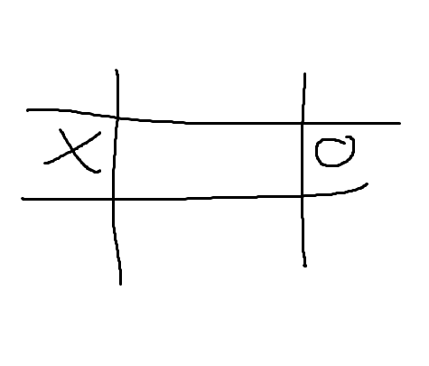

    

# TIC TAC TOE

Adalah sebuah board game dengan 2 player dengan papan 3x3. Player ditujukan untuk mengisi simbol X / O yang sama dalam 3 baris baik bentuk horizontal, vertikal, dan diagonal. Project ini membuat permainan dengan mode lokal dan vs komputer.

# Fitur

1. Pilih mode lokal atau vs komputer.
2. Perhitungan skor.
3. Time travel langkah.

# Install

Install dependencies: `pnpm install`

run: `pnpm run dev`

# Screenshots

